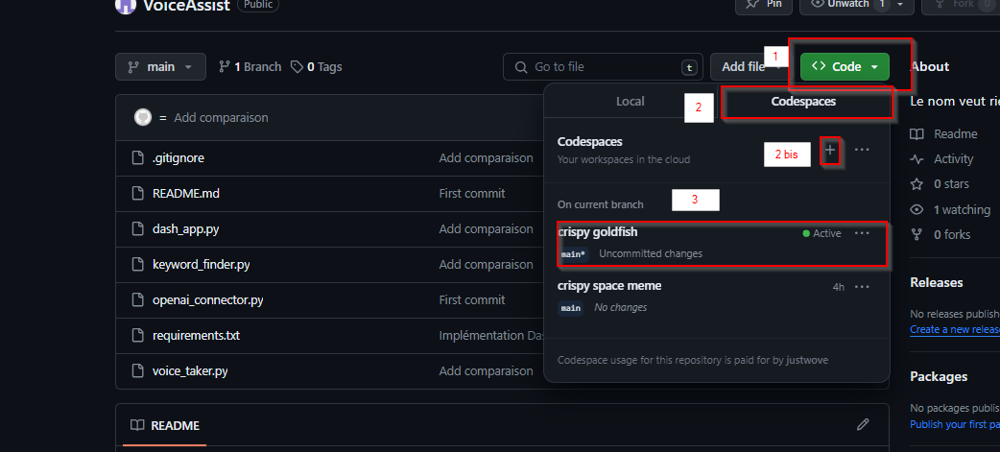
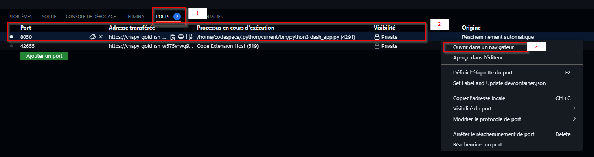
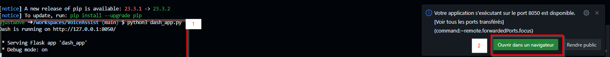

# VoiceAssist
Le nom veut rien dire

# Utilisation 

## GitHub CodeSpace 

Pour utiliser cette outils via GitHub CodeSpace il faut 

1. Crée un CodeSpace 


2. Executez les commandes suivantes dans le terminal
```bash
python3 -m pip install -r requirements.txt
python3 dash_app.py
```

3. Pour accedez à l'interface Dash cliquez sur l'onglet "Ports" -> Clique droit "Ouvrir dans le navigateur" Sur la ligne ou le "Processus en cours d'exécution" est "python3 dash_app.py"


3. Sinon cliquez sur "Ouvrir dans le navigateur"
