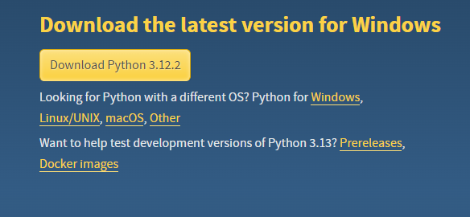

# VoiceAssist
Le nom veut rien dire

# Utilisation 

## Installation Python

Rendez vous sur la page officiel de Python https://www.python.org/downloads/

1. Télécharger la dernière version de Python  


2. Executer le programme d'installation et ajouter python dans le PATH  


3. Télécharger et unziper le code source https://github.com/justwove/VoiceAssist  


4. Ouver un terminal dans le dossier unzipper et executer ces commande  
```bash
python3 -m pip install -r requirements.txt 
python3 dash_app.py
```

5. Rendez vous sur le lien afficher dans le terminal  


6. Uploader vos CV & Fiche de poste par rapport au bouton adéquat (Multi files implémenter)  


7. Lancer un traitement d'un ou plusieurs CV(s) / fiche de poste(s)


A la racine de Dossier (Ou ce trouve se fichier), a chaque traitement un fichier test.xlsx est crée avec un recap des resultats

DISCLAIMER : ATTENTION, a cause d'un bug il faut choisir:
-  1 CV + 1 fiche de poste
- Plusieurs CV + 1 fiche de poste
- 1 CV + Plusieurs fiche de poste 
- Plusieurs CV + Plusieurs fiche de poste /!\ PEUT NE PAS MARCHER, ca dépend des fois :D